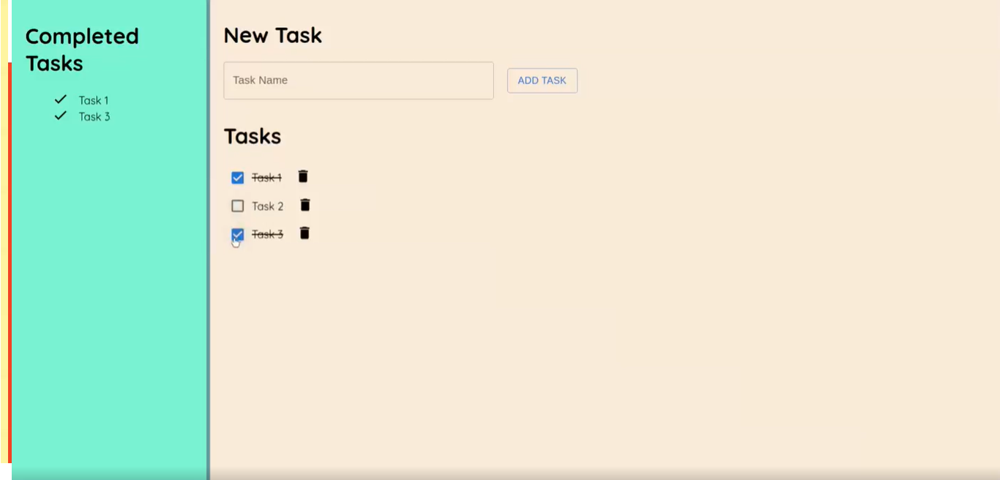

# Todo App

This is a React project, which implements a simple todo app where you can add tasks, mark them as completed and view completed tasks.

# Features:
The project implements the following features:
- Add a new task;
- List all tasks;
- Mark a task as completed;
- Delete tasks;
- Show completed tasks.

# Some preview images of the final project:

**[Video Preview](https://www.linkedin.com/embed/feed/update/urn:li:ugcPost:6968176279091097600)**
